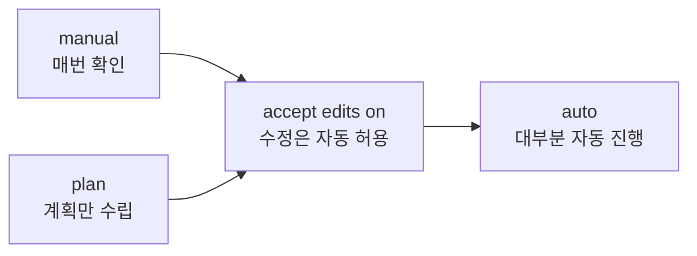

안녕하세요! 오늘은 생성형 AI를 더 잘 활용하는 법을 배운 DAY 4 내용을 정리해볼게요.
**오늘의 학습 목표 → 프롬프트 엔지니어링 → 에이전트화 → 아티팩트 → Claude-VS Code 연동**, 순서대로 짚어볼게요.

## 1. 오늘의 학습 목표

생성형 AI를 이용해서 **위키를 만들어보는 것**이 오늘의 목표예요. DAY 3에서 만든 블로그를 위키처럼 사용하기 위한 준비 과정이라고 해요.

## 2. 프롬프트 엔지니어링

요즘은 모델 성능이 좋아져서, 예전만큼 프롬프트 엔지니어링의 중요성이 크지는 않다고 해요. 오히려 **프롬프트를 과하게 길고 정교하게 작성하는 것은 비효율적**이라는 결론이었어요.

그래도 프롬프트를 쓸 때 중요한 4가지 요소가 있어요.

| 요소 | 의미 | 중요도 |
|---|---|---|
| 맥락 | 내가 지금 처한 상황 | - |
| 역할 | AI한테 부여할 페르소나 | - |
| 제약 | 제한을 걸지 않으면 그 이상으로 답변할 수 있음 | 제일 중요 |
| 예시 | 원하는 형식을 얻기 위해 사용 | 제약 다음으로 중요 |


### 4가지 요소를 담은 프롬프트 예시

실제로 사용했던 프롬프트 예시예요.

```
[맥락]
나는 프로그래밍을 독학으로 조금 해보았다.
저번 주에 Git과 GitHub를 처음 배워보았으며,
내 블로그를 만들어서 인터넷에 배포한 상태이다.
배운 명령어를 정리하고자 한다.

[역할]
프로그래밍을 처음 접하는 학생에게 설명하는 선생님으로서 답변해줘.

[제약]
* 이번 주에 배운 것만 다뤄줘.
  * 저장소 만들기, 스테이징, Local Repository,
    커밋, 브랜치, push, pull, merge, 되돌리기
* 위 목록에 없는 명령어는 작성하지 말아줘
* 표, mermaid 차트, 그리고 flow 차트를 적극 활용해줘.

[예시]
|명령어|언제 쓰나|
|---|---|
|git status|지금 무엇이 바뀌었는지 확인하고 싶을 때|
```

이렇게 네 가지를 갖춰서 요청하면, 원하는 형식과 범위에 맞는 답을 받을 확률이 높아져요.

## 3. 매번 쓰기보다는 에이전트화(자동화)

프롬프트 엔지니어링으로 더 좋은 결과물을 얻을 수 있는 건 맞지만, 매번 이런 식으로 프롬프트를 처음부터 작성하려면 시간이 많이 들어요. 그래서 **에이전트화(자동화)를 시켜서 시간을 단축하는 것이 유리**하다고 배웠어요.

## 4. 아티팩트 (Claude)

아티팩트는 채팅창 옆에 별도로 렌더링되는 대규모 콘텐츠(코드, 문서, 디자인)예요. 일반 채팅 텍스트와 달리, 상호작용과 스타일이 풍부한 결과물을 전달할 때 쓰여요.

## 5. Claude - VS Code 연동

Claude는 VS Code 터미널에서 `claude`라고 입력하면 바로 이용할 수 있어요. 이때 선택할 수 있는 네 가지 모드가 있어요.

| 모드 | 동작 |
|---|---|
| manual | 매번 AI가 무언가 하기 전에 물어봄 |
| accept edits on | 묻지 않고 파일들을 수정함 |
| plan | 계획만 세우고 파일을 고치지 않음 |
| auto | 대부분 묻지 않고 진행함 |



학습하는 단계에서는 **manual과 plan**을 자주 사용한다고 해요. AI를 활용할 때는 한 번에 다 맡기기보다 **단계별로 분석하는 것**이 중요하다고 배웠어요.

또한 `CLAUDE.md` 파일로 **작업지시서**를 만들어둘 수 있는데, 이건 plan 모드를 통해 작성할 수 있어요.

## 오늘 정리표

| 개념 | 핵심 |
|---|---|
| 프롬프트 4요소 | 맥락, 역할, 제약, 예시 |
| 에이전트화 | 매번 쓰는 대신 자동화해서 시간 단축 |
| 아티팩트 | 채팅과 별도로 렌더링되는 결과물 |
| Claude 모드 | manual, accept edits on, plan, auto |
| CLAUDE.md | plan 모드로 작성하는 작업지시서 |

오늘은 여기까지예요! 다음에는 이 내용을 바탕으로 위키를 실제로 만들어볼게요.
