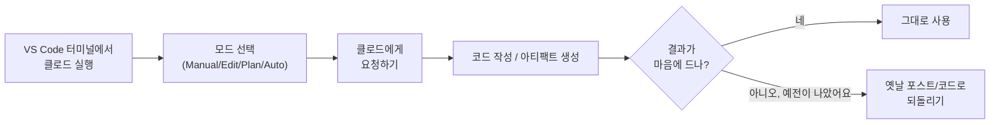
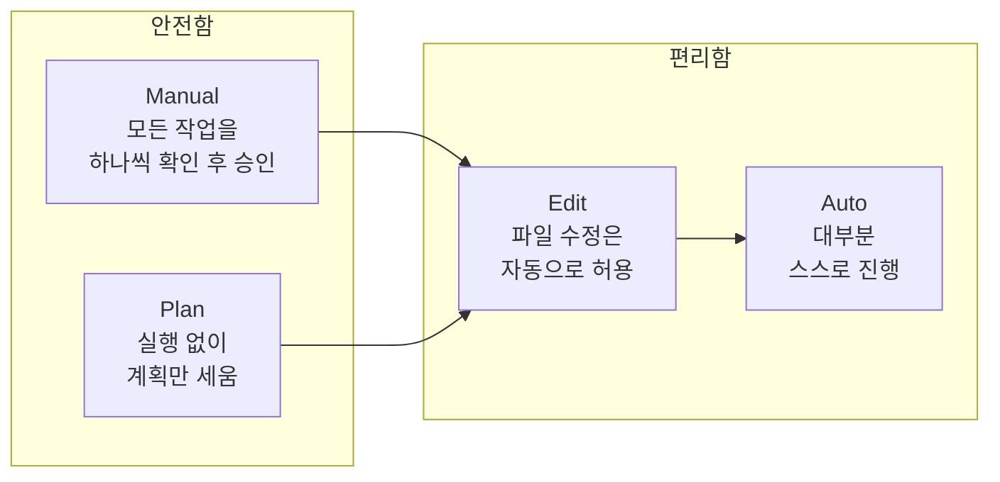
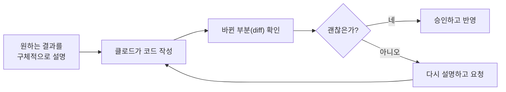

안녕하세요! 이번 주에는 생성형 AI인 **클로드(Claude)**를 실제로 써보는 법을 배웠어요.
**VS Code 터미널에 연결하기 → 모드(Manual/Edit/Plan/Auto) 이해하기 → 아티팩트 → 옛날 포스트로 되돌리기 → 코드 작성 요청하기**, 이번 주에 배운 것만 순서대로 정리해볼게요.

## 1. 전체 흐름 한눈에 보기

## 2. 클로드를 VS Code 터미널로 연결하기

클로드는 별도의 프로그램이 아니라, **VS Code의 통합 터미널 안에서 대화하는 방식**으로 쓸 수 있어요. VS Code를 열고 터미널 창을 연 다음, 클로드를 실행하면 그 순간부터 지금 열려 있는 프로젝트 폴더를 클로드가 함께 볼 수 있게 돼요.

## 3. 네 가지 모드: Manual, Edit, Plan, Auto

클로드가 내 파일을 얼마나 자유롭게 건드릴 수 있는지를 정하는 게 **모드**예요. 안전함과 편리함 사이에서 상황에 맞게 고르면 돼요.

| 모드 | 언제 쓰나 |
|---|---|
| Manual | 클로드를 처음 써보거나, 하나하나 직접 확인하고 싶을 때 |
| Plan | 아직 코드는 건드리지 말고, 어떻게 할지 계획부터 보고 싶을 때 |
| Edit | 파일 수정 정도는 믿고 맡기고, 반복 승인은 줄이고 싶을 때 |
| Auto | 익숙하고 반복적인 작업을 빠르게 끝내고 싶을 때 |

## 4. 아티팩트(Artifact)

아티팩트는 클로드가 만들어준 결과물(예: 웹페이지)을 **바로 열어볼 수 있는 페이지**로 만들어주는 기능이에요. 코드만 텍스트로 받는 게 아니라, 실제로 어떻게 보이는지 확인할 수 있어서 편해요.

## 5. 클로드를 이용해 옛날 포스트로 되돌리기

전에 Git으로 "되돌리기"를 배웠었죠? 클로드는 그 되돌리기 작업도 대신 해줄 수 있어요. "이전 버전으로 되돌려줘"라고 요청하면, 클로드가 지난 커밋 기록을 확인하고 그 시점의 내용으로 파일을 되돌려줘요.

## 6. 클로드를 통해 코드 작성하는 법

클로드에게 코드를 맡길 때는 **무엇을, 왜 원하는지 구체적으로 설명**하는 게 중요해요. 클로드가 코드를 작성해주면, 바로 반영하기 전에 어떤 부분이 바뀌는지 확인하고 승인하는 과정을 거쳐요.

## 이번 주 정리표

| 기능 | 언제 쓰나 |
|---|---|
| VS Code 터미널 연결 | 프로젝트 폴더 안에서 클로드와 바로 대화하고 싶을 때 |
| Manual 모드 | 하나하나 직접 확인하며 신중하게 진행하고 싶을 때 |
| Plan 모드 | 실행 전에 어떤 계획인지 먼저 보고 싶을 때 |
| Edit 모드 | 파일 수정 승인 과정을 줄이고 싶을 때 |
| Auto 모드 | 익숙한 작업을 빠르게 반복 처리하고 싶을 때 |
| 아티팩트 | 결과물을 코드가 아니라 실제 화면으로 바로 보고 싶을 때 |
| 되돌리기 요청 | 이전 포스트나 코드로 다시 돌아가고 싶을 때 |
| 코드 작성 요청 | 원하는 기능을 설명하고 클로드에게 구현을 맡기고 싶을 때 |

이번 주는 여기까지예요! 다음에는 클로드에게 요청할 때 더 좋은 프롬프트를 쓰는 법을 다뤄볼게요.
