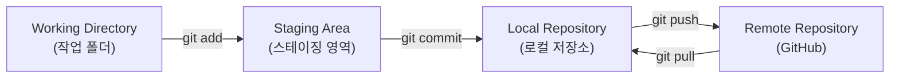
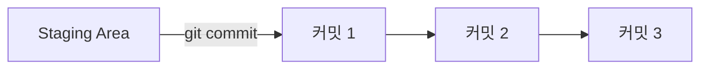
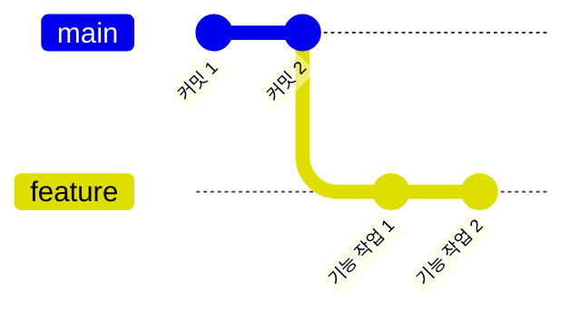
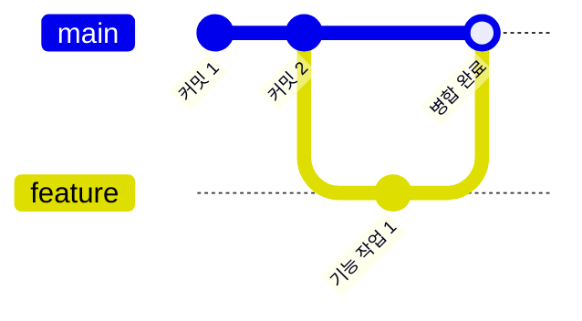
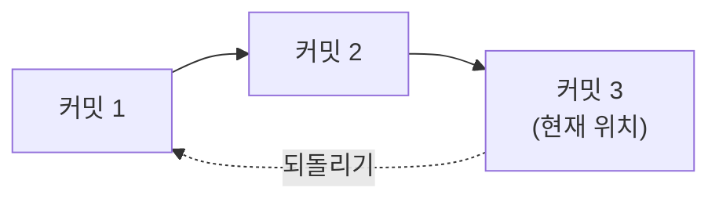

안녕하세요! 이번 주에 Git과 GitHub를 처음 배운 내용을 정리해 볼게요.
**저장소 만들기 → 스테이징 → 커밋 → 브랜치 → push/pull → merge → 되돌리기**, 딱 이번 주에 배운 것만 순서대로 짚어볼게요.

## 1. 전체 흐름 한눈에 보기

Git으로 작업할 때 파일이 거쳐 가는 공간은 크게 네 곳이에요. 이걸 먼저 그림으로 익혀두면 나머지 명령어들이 훨씬 쉽게 이해돼요.

- **Working Directory**: 지금 내가 파일을 고치고 있는 폴더예요.
- **Staging Area**: "이번 커밋에 담을 파일"만 따로 모아두는 대기 공간이에요.
- **Local Repository**: 내 컴퓨터 안에 저장된 커밋 기록이에요.
- **Remote Repository**: GitHub처럼 인터넷에 있는 저장소예요.

## 2. 저장소 만들기

새로운 프로젝트를 Git으로 관리하고 싶으면, 폴더를 저장소로 만드는 것부터 시작해요. 이 폴더 안에 눈에 보이지 않는 `.git` 폴더가 생기면서, 그때부터 Git이 변경 사항을 추적할 수 있게 돼요.

## 3. 스테이징

파일을 수정했다고 해서 바로 커밋되는 게 아니에요. **"이번 커밋에는 이 파일들을 포함시킬게"** 하고 고르는 단계가 스테이징이에요. 파일을 여러 개 고쳤어도, 그중 관련 있는 것만 골라서 커밋할 수 있어서 유용해요.

## 4. Local Repository와 커밋

스테이징한 파일들을 **하나의 저장 지점(스냅샷)** 으로 기록하는 게 커밋이에요. 커밋을 하면 그 기록이 내 컴퓨터의 Local Repository에 쌓여요. 나중에 문제가 생기면 이 기록들 덕분에 이전 시점으로 돌아갈 수 있어요.

## 5. 브랜치

브랜치는 **원본을 건드리지 않고 새로운 작업을 시도해볼 수 있는 갈림길**이에요. `main` 브랜치는 그대로 두고, 새 브랜치를 만들어서 거기서 작업한 뒤 나중에 합칠 수 있어요.

## 6. push와 pull

- **push**: 내 Local Repository에 쌓인 커밋들을 GitHub(원격 저장소)로 올리는 거예요.
- **pull**: 반대로 GitHub에 있는 최신 기록을 내 Local Repository로 가져오는 거예요.

다른 컴퓨터에서 작업했거나, 팀원이 먼저 올린 내용이 있을 때는 꼭 pull부터 해서 최신 상태로 맞춰야 해요.

## 7. merge

브랜치에서 작업을 끝냈으면, 그 내용을 원래 브랜치(main)로 합쳐야겠죠? 그게 merge예요.

## 8. 되돌리기

커밋을 잘못했거나 실수로 진행 방향이 틀렸을 때, 이전 커밋 시점으로 되돌릴 수 있어요. Git이 모든 커밋을 기록으로 남겨두기 때문에 가능한 일이에요.

## 이번 주 명령어 정리표

| 명령어 | 언제 쓰나 |
|---|---|
| `git init` | 새 폴더를 Git 저장소로 만들고 싶을 때 |
| `git add` | 변경한 파일 중 커밋에 담을 것을 고르고 싶을 때 (스테이징) |
| `git commit` | 스테이징한 내용을 하나의 저장 지점으로 기록하고 싶을 때 |
| `git branch` | 새 브랜치를 만들거나 브랜치 목록을 보고 싶을 때 |
| `git checkout` | 다른 브랜치로 옮겨가고 싶을 때 |
| `git push` | 로컬 저장소의 기록을 GitHub에 올리고 싶을 때 |
| `git pull` | GitHub의 최신 기록을 내 로컬로 가져오고 싶을 때 |
| `git merge` | 다른 브랜치의 작업을 지금 브랜치로 합치고 싶을 때 |
| `git reset` | 커밋을 취소하고 이전 상태로 되돌리고 싶을 때 |

이번 주는 여기까지! 다음에는 이 명령어들을 실제로 손에 익히면서, 브랜치를 합칠 때 생기는 충돌(conflict)도 다뤄볼게요.
