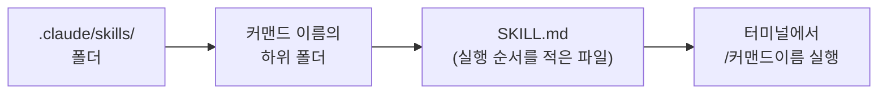

안녕하세요! 이번 주에는 **생성형 AI를 VS Code에 연동해서, 블로그 글 쓰는 반복 작업을 자동화**하는 법을 배웠어요.
**연동한 이유 → 터미널에서 글쓰기 → 나만의 슬래시 커맨드 만들기 → 겪은 시행착오 → 달라진 점**, 순서대로 정리해볼게요.

## 1. 전체 흐름 한눈에 보기

## 2. 왜 연동했나: 반복 작업이 귀찮아서

글을 하나 쓸 때마다 `_posts` 폴더에 파일을 만들고, 파일명을 `YYYY-MM-DD-제목.md` 형식으로 맞추고, 맨 위에 머리말(front matter)을 챙겨 넣는 과정을 매번 손으로 반복하고 있었어요. 이 반복 작업을 줄이고 싶어서, VS Code 터미널에 생성형 AI를 연동해 이 과정 자체를 맡기기로 했어요.

## 3. 터미널에서 바로 글쓰기

VS Code 터미널에 AI를 연동하고 나면, 에디터를 손으로 조작하지 않고 **터미널에 문장을 입력하는 것만으로 글 작성이 끝나는** 흐름을 만들 수 있어요. AI가 파일명 규칙과 머리말 형식을 기억하고 있어서, 매번 같은 규칙을 다시 설명할 필요가 없어졌어요.

## 4. 나만의 슬래시 커맨드 만들기

여기서 한 단계 더 나아가서, 자주 쓰는 요청을 **슬래시 커맨드**(예: `/note`)로 직접 만들어봤어요. 슬래시 커맨드는 특별한 프로그램이 아니라, 정해진 폴더 안에 "이 명령어를 실행하면 무엇을 할지" 적어둔 안내 파일이에요.

## 5. 겪은 시행착오: 커맨드 파일 구조를 몰라서 헤맴

처음에는 이 커맨드 파일을 **어느 폴더에, 어떤 형식으로** 만들어야 하는지 몰라서 헤맸어요. 커맨드마다 정해진 폴더 구조(예: `.claude/skills/커맨드이름/SKILL.md`)를 따라야 인식된다는 걸 직접 만들어보면서 알게 됐어요.

## 6. 달라진 점: 형식을 매번 안 챙겨도 됨

결과적으로, 글 작성 형식(파일명 규칙, 머리말 형식)을 **매번 손으로 챙기지 않아도** 되게 됐어요. 터미널에 명령어 하나만 입력하면 그 뒤 과정을 AI가 규칙에 맞춰 대신 처리해줘요.

## 이번 주 정리표

| 개념 | 언제 쓰나 |
|---|---|
| VS Code + 생성형 AI 연동 | 터미널에서 바로 AI에게 작업을 맡기고 싶을 때 |
| 슬래시 커맨드 | 자주 반복하는 요청을 짧은 명령어로 저장해두고 싶을 때 |
| `.claude/skills/커맨드이름/SKILL.md` | 커맨드가 실행할 때 따라야 할 순서를 정의하고 싶을 때 |

이번 주는 여기까지예요! 다음에는 만든 커맨드에 조건을 더 추가해서, 상황에 따라 다르게 동작하도록 다듬어볼게요.
