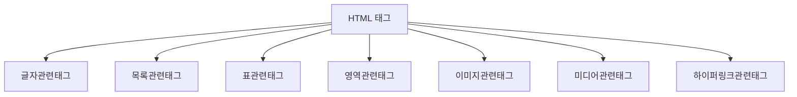
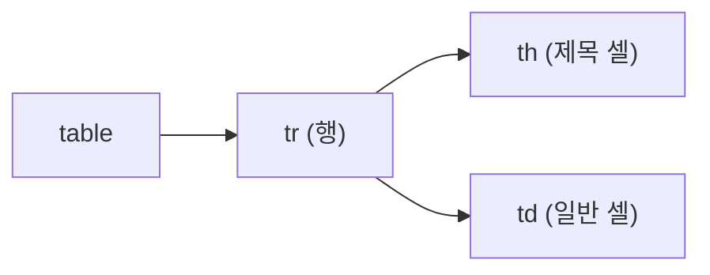

안녕하세요! 오늘은 HTML의 다양한 태그를 배운 DAY 5 내용을 정리해볼게요.
**글자관련태그 → 목록관련태그 → 표관련태그 → 영역관련태그 → 이미지관련태그 → 미디어관련태그 → 하이퍼링크관련태그**, 순서대로 짚어볼게요.

## 1. 오늘 배운 태그 한눈에 보기

오늘은 HTML 태그를 역할별로 크게 7가지로 나눠서 배웠어요. 이렇게 태그를 "역할"로 묶어서 이해하면, 새로운 태그를 만나도 "아, 이건 표 관련이구나" 하고 빠르게 감을 잡을 수 있어요.

## 2. 글자관련 태그

글자를 꾸미는 태그들이에요. 재밌는 점은, **비슷하게 생겼지만 의미가 다른 짝**이 있다는 거예요. `<b>`와 `<strong>`은 둘 다 글자를 굵게 보여주지만, `<strong>`은 "이 내용이 정말 중요하다"는 의미까지 담고 있어요. `<i>`와 `<em>`도 마찬가지로, `<em>`은 단순히 기울이는 게 아니라 "강조"의 의미를 가져요.

| 태그 | 의미 |
|---|---|
| `<b>` | 글자를 굵게 표시 (의미는 없음) |
| `<strong>` | 중요하다는 의미를 담아 굵게 표시 |
| `<i>` | 글자를 기울여 표시 (의미는 없음) |
| `<em>` | 강조의 의미를 담아 기울여 표시 |
| `<mark>` | 형광펜을 칠한 것처럼 하이라이트 표시 |
| `<del>` | 삭제된 내용임을 취소선으로 표시 |

## 3. 목록관련 태그

여러 항목을 나열할 때 쓰는 태그들이에요. 순서가 중요한지 아닌지에 따라 다른 태그를 골라 써요.

| 태그 | 의미 |
|---|---|
| `<ul>` | 순서가 없는 목록 |
| `<ol>` | 순서가 있는 목록 |
| `<li>` | 목록 안의 각 항목 |
| `<dl>` | 용어와 설명을 짝지어 보여주는 설명 목록 |

## 4. 표관련 태그

데이터를 행과 열로 정리할 때 쓰는 태그들이에요.

| 태그 | 의미 |
|---|---|
| `<table>` | 표 전체를 감싸는 태그 |
| `<tr>` | 표의 한 행(row) |
| `<th>` | 표의 제목 셀 (기본적으로 굵게, 가운데 정렬) |
| `<td>` | 표의 일반 데이터 셀 |

## 5. 영역관련 태그

콘텐츠를 묶어서 하나의 덩어리로 다룰 때 쓰는 태그예요. 가장 큰 차이는 **줄바꿈이 생기는지**예요.

| 태그 | 의미 |
|---|---|
| `
` | 줄바꿈이 있는 블록 영역 |
| `` | 줄바꿈 없이 문장 중간에 쓰는 인라인 영역 |

## 6. 이미지관련 태그

이미지를 보여주고, 필요하면 설명까지 붙이는 태그들이에요.

| 태그/속성 | 의미 |
|---|---|
| `` | 보여줄 이미지의 경로 지정 |
| `` | 이미지를 못 볼 때 대신 보여줄 대체 텍스트 |
| `` | 이미지의 너비 지정 |
| `<figure>` | 이미지 같은 콘텐츠를 캡션과 함께 묶는 영역 |
| `<figcaption>` | `<figure>` 안 콘텐츠의 설명(캡션) |

## 7. 미디어관련 태그

동영상과 소리를 재생할 때 쓰는 태그들이에요.

| 태그 | 의미 |
|---|---|
| `<video>` | 동영상을 재생 |
| `<audio>` | 소리(음악 등)를 재생 |

## 8. 하이퍼링크관련 태그

다른 페이지나 파일로 이동하는 링크를 만드는 태그예요. `<a>` 태그에 어떤 속성을 붙이느냐에 따라 동작이 달라져요.

| 태그/속성 | 의미 |
|---|---|
| `<a href="">` | 이동할 주소 지정 |
| `<a target="_blank">` | 새 탭에서 열기 |
| `<a download>` | 클릭 시 파일 다운로드 |

## 오늘 정리표

| 분류 | 태그 | 언제 쓰나 |
|---|---|---|
| 글자 | `<b>` / `<i>` | 의미 없이 굵게/기울임만 필요할 때 |
| 글자 | `<strong>` / `<em>` | 중요함/강조의 의미까지 담고 싶을 때 |
| 글자 | `<mark>` | 형광펜처럼 눈에 띄게 표시하고 싶을 때 |
| 글자 | `<del>` | 삭제된 내용임을 보여주고 싶을 때 |
| 목록 | `<ul>` / `<ol>` / `<li>` | 순서 없는/있는 목록을 만들 때 |
| 목록 | `<dl>` | 용어-설명 쌍으로 정리하고 싶을 때 |
| 표 | `<table>` / `<tr>` / `<th>` / `<td>` | 데이터를 행과 열로 정리할 때 |
| 영역 | `
` | 줄바꿈이 있는 큰 덩어리로 묶을 때 |
| 영역 | `` | 문장 중간 일부만 따로 스타일링할 때 |
| 이미지 | `` | 이미지를 보여줄 때 |
| 이미지 | `<figure>` / `<figcaption>` | 이미지에 캡션(설명)을 붙일 때 |
| 미디어 | `<video>` / `<audio>` | 동영상/소리를 재생할 때 |
| 링크 | `<a>` | 다른 페이지나 파일로 이동시키고 싶을 때 |

## 더 학습하면 좋은 개념

- **시맨틱 태그(Semantic Tags)** — 오늘은 `
`, ``처럼 의미 없는 영역 태그만 배웠는데, `<header>`, `<nav>`, `<section>`, `<article>`, `<footer>`처럼 "이 영역이 무엇인지" 의미를 담은 태그도 있어요. 검색엔진과 화면낭독기가 페이지 구조를 이해하는 데 큰 도움이 돼요.
- **웹 접근성(Web Accessibility, a11y)** — 오늘 배운 `alt` 속성이 바로 접근성의 시작이에요. 시각장애인이 스크린 리더로 웹을 이용할 때, 잘 작성된 `alt`와 시맨틱 태그가 얼마나 중요한지 알아두면 좋아요.
- **CSS 박스 모델(Box Model)** — `
`나 ``으로 영역을 나눈 다음에는 결국 CSS로 크기·여백·테두리를 조절하게 돼요. 박스 모델을 이해하면 오늘 배운 영역 태그들을 실제로 어떻게 배치할지 감이 잡혀요.
- **표 태그 심화(`<thead>`, `<tbody>`, `colspan`, `rowspan`)** — 오늘은 `<table>`, `<tr>`, `<th>`, `<td>`까지만 배웠는데, 표의 머리/본문을 구분하거나 셀을 합치는 태그도 있어요. 복잡한 표를 다룰 때 필요해요.
- **`rel="noopener noreferrer"`** — `target="_blank"`로 새 탭을 열 때, 보안을 위해 함께 붙이는 속성이에요. 새로 열린 탭이 원래 페이지를 조작할 수 없도록 막아주는 역할을 해요.

## 참고 자료

- [MDN - HTML elements reference](https://developer.mozilla.org/en-US/docs/Web/HTML/Element)
- [MDN - `<table>`: The Table element](https://developer.mozilla.org/en-US/docs/Web/HTML/Element/table)
- [MDN - ``: The Image Embed element](https://developer.mozilla.org/en-US/docs/Web/HTML/Element/img)
- [MDN - `<a>`: The Anchor element](https://developer.mozilla.org/en-US/docs/Web/HTML/Element/a)
- [MDN - Web accessibility basics](https://developer.mozilla.org/en-US/docs/Learn/Accessibility)

오늘은 여기까지예요! 다음에는 이 태그들을 실제로 조합해서 페이지 하나를 만들어볼게요.
