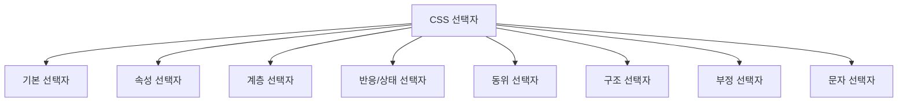
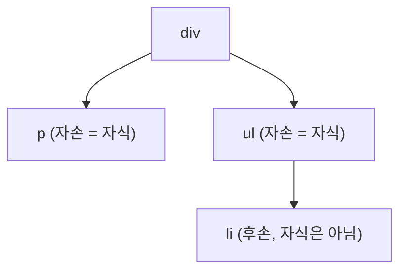
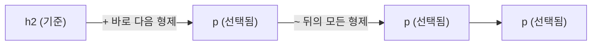

안녕하세요! 오늘은 CSS **선택자(Selector)**를 배운 DAY 6 내용을 정리해볼게요.
선택자는 "HTML의 어떤 요소를 꾸밀지 고르는 방법"이에요. 오늘은 기본 선택자부터 속성, 계층, 반응, 상태, 동위, 구조, 부정, 문자 선택자까지 차근차근 짚어볼게요.

## 1. 오늘 배운 선택자 한눈에 보기

## 2. 기본 선택자 (Basic Selectors)

가장 먼저 배운, 요소를 고르는 기본적인 4가지 방법이에요.

| 선택자 | 의미 |
|---|---|
| `*` | 전체 선택자, 모든 요소를 선택 |
| `li` | 태그 선택자, `<li>`처럼 특정 태그명으로 선택 |
| `#id명` | ID 선택자, 페이지 안에서 유일한 `id` 속성으로 선택 |
| `.class명` | 클래스 선택자, 여러 요소에 재사용 가능한 `class` 속성으로 선택 |

## 3. 속성 선택자 (Attribute Selectors)

`[속성명=속성값]` 형태로, 특정 속성을 가진 요소만 골라내는 선택자예요. `=` 앞뒤에 어떤 기호가 붙느냐에 따라 "정확히 일치"부터 "포함"까지 다양하게 고를 수 있어요.

| 선택자 | 의미 |
|---|---|
| `[속성=값]` | 속성값이 정확히 일치하는 요소 선택 |
| `[속성~=값]` | 공백으로 구분된 값들 중 하나가 일치하는 요소 선택 |
| `[속성\|=값]` | 값과 정확히 같거나, `값-`로 시작하는 요소 선택 (언어 코드 등에 사용) |
| `[속성^=값]` | 속성값이 해당 값으로 **시작**하는 요소 선택 |
| `[속성$=값]` | 속성값이 해당 값으로 **끝나는** 요소 선택 |
| `[속성*=값]` | 속성값에 해당 값이 **포함**된 요소 선택 |

## 4. 계층 선택자: 자손 vs 후손

같은 조상-자식 관계라도, **바로 아래인지 아니면 그 아래 전부인지**에 따라 선택자가 달라져요.

| 선택자 | 이름 | 의미 |
|---|---|---|
| `div > p` | 자손 선택자 | `div`의 **바로 아래** 있는 `p`만 선택 |
| `div p` | 후손 선택자 | `div` **하위의 모든** `p`를 선택 (몇 단계든 상관없이) |

## 5. 반응 선택자 (:active, :hover)

사용자의 마우스 동작에 반응하는 선택자예요.

| 선택자 | 의미 |
|---|---|
| `:hover` | 마우스를 요소 위에 올렸을 때 |
| `:active` | 요소를 클릭하는 그 순간 |

## 6. 상태 선택자 (:checked, :enabled, :disabled, :focus)

폼(form) 요소가 현재 어떤 상태인지에 따라 스타일을 다르게 줄 때 사용해요.

| 선택자 | 의미 |
|---|---|
| `:checked` | 체크박스/라디오 버튼이 선택된 상태 |
| `:enabled` | 입력이 가능한(활성화된) 상태 |
| `:disabled` | 입력이 불가능한(비활성화된) 상태 |
| `:focus` | 클릭이나 탭 이동으로 포커스를 받은 상태 |

## 7. 동위 선택자 (형제 관계)

부모가 같은 "형제" 요소들 사이의 관계를 나타내는 선택자예요.

| 선택자 | 의미 |
|---|---|
| `h2 + p` | `h2` 바로 다음에 오는 형제 `p` **하나만** 선택 |
| `h2 ~ p` | `h2` 뒤에 오는 형제 `p`를 **모두** 선택 |

## 8. 구조 선택자

부모 안에서 요소의 **위치**를 기준으로 고르는 선택자예요.

| 선택자 | 의미 |
|---|---|
| `:first-child` | 부모의 첫 번째 자식일 때 선택 |
| `:last-child` | 부모의 마지막 자식일 때 선택 |
| `:nth-child(n)` | 부모의 `n`번째 자식일 때 선택 (`2n`, `odd` 등 공식 사용 가능) |

## 9. 부정 선택자 (:not())

괄호 안의 조건에 **해당하지 않는** 요소만 골라낼 때 사용해요.

| 선택자 | 의미 |
|---|---|
| `:not(조건)` | 괄호 안 조건을 만족하지 **않는** 요소 선택 |

## 10. 문자 선택자

요소 전체가 아니라, 텍스트의 **일부분**만 콕 집어서 스타일을 줄 때 쓰는 선택자예요.

| 선택자 | 의미 |
|---|---|
| `::first-letter` | 텍스트의 첫 글자만 선택 |
| `::selection` | 사용자가 마우스로 드래그해서 선택한 텍스트 부분 |

## 오늘 정리표

| 분류 | 선택자 | 언제 쓰나 |
|---|---|---|
| 기본 | `*` / `태그` / `#id` / `.class` | 요소를 종류별로 기본적으로 고를 때 |
| 속성 | `[속성=값]` 등 | 특정 속성이나 속성값 패턴으로 고를 때 |
| 계층 | `A > B` | A의 바로 아래 자식 B만 고를 때 |
| 계층 | `A B` | A 하위의 모든 후손 B를 고를 때 |
| 반응 | `:hover` / `:active` | 마우스 오버/클릭 순간에 스타일을 줄 때 |
| 상태 | `:checked` / `:enabled` / `:disabled` / `:focus` | 폼 요소의 현재 상태에 따라 스타일을 줄 때 |
| 동위 | `A + B` | A 바로 다음 형제 B 하나만 고를 때 |
| 동위 | `A ~ B` | A 뒤에 있는 형제 B를 전부 고를 때 |
| 구조 | `:first-child` / `:last-child` / `:nth-child()` | 위치(순서) 기준으로 고를 때 |
| 부정 | `:not()` | 특정 조건을 제외하고 고를 때 |
| 문자 | `::first-letter` / `::selection` | 텍스트의 일부분만 스타일을 줄 때 |

## 더 학습하면 좋은 개념

- **선택자 우선순위(Specificity)** — 오늘 배운 여러 선택자가 한 요소에 동시에 적용되면, 브라우저는 우선순위 규칙에 따라 어떤 스타일을 적용할지 정해요. ID, 클래스, 태그 선택자의 우선순위 점수를 이해하면 "왜 내 CSS가 안 먹히지?" 하는 상황을 해결할 수 있어요.
- **가상 요소 vs 가상 클래스** — `:hover`처럼 콜론 1개인 가상 클래스와 `::first-letter`처럼 콜론 2개인 가상 요소는 서로 다른 개념이에요. 이 둘을 구분해서 이해하면 선택자를 더 정확히 쓸 수 있어요.
- **CSS 상속(Inheritance)** — 후손 선택자로 스타일을 적용하다 보면, 어떤 속성은 부모에서 자식으로 자동으로 상속된다는 걸 알게 돼요. `color`나 `font-size` 같은 속성이 왜 하위 요소에도 자동 적용되는지 알아두면 좋아요.
- **CSS 박스 모델(Box Model)** — 선택자로 요소를 골랐다면, 이제 그 요소의 크기·여백·테두리를 다뤄야 해요. 박스 모델을 알면 선택한 요소를 실제로 어떻게 배치할지 감이 잡혀요.
- **CSS 명세 vs 브라우저 호환성** — `:has()`처럼 최신 선택자는 브라우저마다 지원 시점이 달라요. [Can I use](https://caniuse.com/) 같은 사이트로 브라우저 지원 여부를 확인하는 습관을 들이면 좋아요.

## 참고 자료

- [MDN - CSS 선택자 개요](https://developer.mozilla.org/ko/docs/Web/CSS/CSS_selectors)
- [MDN - 속성 선택자](https://developer.mozilla.org/ko/docs/Web/CSS/Attribute_selectors)
- [MDN - 가상 클래스](https://developer.mozilla.org/ko/docs/Web/CSS/Pseudo-classes)
- [MDN - 가상 요소](https://developer.mozilla.org/ko/docs/Web/CSS/Pseudo-elements)
- [MDN - :nth-child()](https://developer.mozilla.org/ko/docs/Web/CSS/:nth-child)

오늘은 여기까지예요! 다음에는 선택자로 고른 요소들을 실제로 어떻게 배치하는지, 박스 모델을 정리해볼게요.
