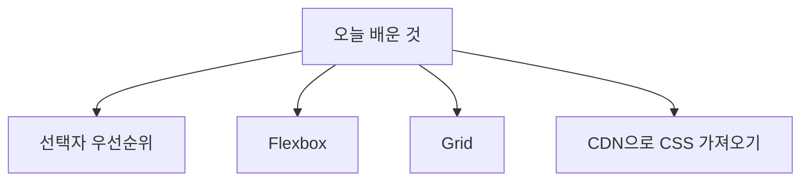
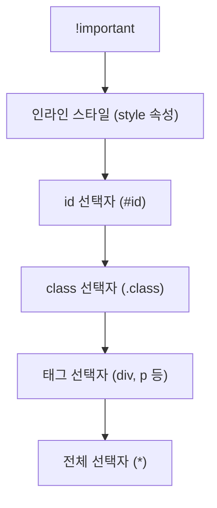
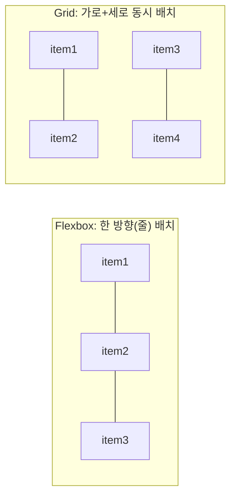

안녕하세요! DAY 6에서 CSS 선택자를 정리하면서 "다음엔 우선순위를 알아보자"고 했었죠? 오늘은 그 약속대로 **선택자 우선순위**를 배웠고, 여기에 더해 요소를 배치하는 **Flexbox**와 **Grid**, 그리고 Tailwind 같은 외부 CSS를 가져오는 방법까지 배운 DAY 7 내용을 정리해볼게요.

## 1. 오늘 배운 내용 한눈에 보기



## 2. 선택자 우선순위 (Specificity)

한 요소에 여러 선택자의 스타일이 동시에 걸리면, 브라우저는 정해진 순서에 따라 **어떤 스타일을 최종 적용할지** 결정해요. 오늘은 그 순서를 배웠어요.



| 순위 | 종류 | 예시 |
|---|---|---|
| 1 (가장 높음) | `!important` | `color: red !important;` |
| 2 | 인라인 스타일 | `<div style="color: red;">` |
| 3 | id 선택자 | `#title` |
| 4 | class 선택자 | `.box` |
| 5 | 태그 선택자 | `div`, `p` |
| 6 (가장 낮음) | 전체 선택자 | `*` |

즉, 같은 요소에 `.box`로 준 스타일과 `#title`로 준 스타일이 충돌하면, **id 선택자인 `#title` 쪽이 이긴다**는 뜻이에요. 그리고 `!important`가 붙으면 이 순서를 다 무시하고 무조건 최우선으로 적용돼요.

> :경고: `!important`는 순서를 강제로 뒤집는 만큼, 남용하면 나중에 어떤 스타일이 왜 적용됐는지 추적하기 어려워져요. 정말 필요한 경우에만 최소한으로 사용하는 게 좋다고 해요.

## 3. Flexbox로 요소 배치하기

`display: flex`를 주면 자식 요소들을 **한 줄(가로) 또는 한 열(세로)**로 유연하게 배치할 수 있어요.

| 속성 | 의미 |
|---|---|
| `display: flex` | 부모 요소를 flex 컨테이너로 만듦 |
| `flex-direction` | 자식들을 배치할 방향 (`row`: 가로, `column`: 세로) |
| `justify-content` | 주축(방향) 기준 정렬 (예: `center`, `space-between`) |
| `align-items` | 교차축(방향과 수직) 기준 정렬 (예: `center`, `stretch`) |
| `flex-wrap` | 자식 요소가 넘칠 때 줄바꿈 여부 (`nowrap`, `wrap`) |
| `flex-grow` | 남는 공간을 자식이 얼마나 차지해서 늘어날지 |
| `flex-shrink` | 공간이 부족할 때 자식이 얼마나 줄어들지 |

```css
.container {
  display: flex;
  flex-direction: row;
  justify-content: space-between;
  align-items: center;
  flex-wrap: wrap;
}
```

## 4. Grid로 요소 배치하기

`display: grid`는 Flexbox와 다르게 **가로와 세로를 동시에** 격자(그리드) 형태로 배치할 때 사용해요.

| 속성 | 의미 |
|---|---|
| `display: grid` | 부모 요소를 grid 컨테이너로 만듦 |
| `grid-template-columns` | 열(세로줄)의 개수와 너비를 지정 |
| `grid-template-rows` | 행(가로줄)의 개수와 높이를 지정 |
| `gap` | 격자 칸 사이의 간격 |
| `grid-area` | 특정 자식 요소를 그리드의 원하는 위치(영역)에 배치 |

```css
.container {
  display: grid;
  grid-template-columns: 1fr 1fr 1fr;
  grid-template-rows: auto auto;
  gap: 10px;
}

.item {
  grid-area: 1 / 1 / 2 / 3;
}
```



## 5. 외부 사이트에서 CSS 가져오기: CDN

Tailwind처럼 미리 만들어진 CSS를 직접 다운로드하지 않고도, **CDN(Content Delivery Network) 주소를 `<script>`나 `<link>` 태그에 넣는 방식**으로 바로 가져와 쓸 수 있다는 걸 배웠어요.

```html
<head>
  <script src="https://cdn.tailwindcss.com"></script>
</head>
```

이렇게 CDN 주소를 넣어두면, 별도의 설치 과정 없이 해당 사이트가 제공하는 CSS(또는 CSS를 만들어주는 스크립트)를 바로 내 HTML에서 사용할 수 있어요.

## 오늘 정리표

| 분류 | 내용 | 언제 쓰나 |
|---|---|---|
| 우선순위 | `!important` > 인라인 > `#id` > `.class` > 태그 > `*` | 스타일이 충돌할 때 어떤 게 적용될지 판단할 때 |
| Flexbox | `display: flex`, `flex-direction`, `justify-content`, `align-items`, `flex-wrap`, `flex-grow`, `flex-shrink` | 요소를 한 방향(가로/세로)으로 유연하게 배치할 때 |
| Grid | `display: grid`, `grid-template-columns/rows`, `gap`, `grid-area` | 요소를 가로·세로 격자 형태로 배치할 때 |
| CDN | `<script src="...">` / `<link href="...">` | Tailwind 같은 외부 CSS를 설치 없이 바로 가져올 때 |

## 더 학습하면 좋은 개념

- **선택자 점수 계산법 (Specificity 점수)** — 오늘은 우선순위의 "순서"만 배웠는데, 실제로는 id·class·태그 선택자마다 점수가 매겨지고 그 합으로 우선순위가 정해져요. 점수 계산법을 알면 복잡한 선택자 조합에서도 어떤 스타일이 이길지 정확히 예측할 수 있어요.
- **flex-basis와 gap** — 오늘 배운 flex-grow/shrink와 함께 쓰이는 속성으로, 자식 요소의 기본 크기와 요소 사이 간격을 다루는 방법이에요. Flexbox를 더 세밀하게 조절할 때 필요해요.
- **grid의 `repeat()`, `minmax()`, `fr` 단위** — 오늘 배운 `grid-template-columns`를 더 간결하고 반응형으로 쓰기 위한 문법이에요. 화면 크기에 따라 자동으로 열 개수가 바뀌는 레이아웃을 만들 때 유용해요.
- **Utility-First CSS 개념** — Tailwind를 CDN으로 불러온 뒤에는, 클래스 이름 조합만으로 스타일을 주는 "유틸리티 우선" 방식을 이해해야 제대로 활용할 수 있어요.
- **CDN 방식 vs 빌드(npm) 방식의 차이** — CDN은 빠르게 써볼 수 있지만, 실제 서비스에서는 npm으로 설치해서 필요한 CSS만 빌드하는 방식을 더 많이 써요. 두 방식의 장단점을 알아두면 프로젝트 규모에 맞는 선택을 할 수 있어요.

## 참고 자료

- [MDN - CSS 우선순위(Specificity)](https://developer.mozilla.org/ko/docs/Web/CSS/Specificity)
- [MDN - Flexbox 기본 개념](https://developer.mozilla.org/ko/docs/Web/CSS/CSS_flexible_box_layout/Basic_concepts_of_flexbox)
- [MDN - CSS Grid 기본 개념](https://developer.mozilla.org/ko/docs/Web/CSS/CSS_grid_layout/Basic_concepts_of_grid_layout)
- [Tailwind CSS 공식 문서 - Play CDN](https://tailwindcss.com/docs/installation/play-cdn)

오늘은 여기까지예요! 다음에는 Flexbox와 Grid를 실제로 조합해서 레이아웃을 짜보는 연습을 정리해볼게요.
