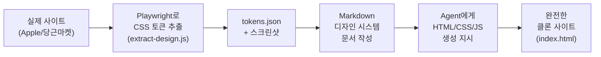

## 들어가며

Node.js를 처음 설치하고, Playwright를 배우고, Claude Code를 활용하면서 한 가지 깨달았다. **AI 도구는 단순한 코드 생성 도구가 아니라, 우리의 상상을 빠르게 현실로 만드는 수단**이라는 것이다. 

실제로 프롬프트 하나로 복잡한 게임 로직을 만들 수 있고, 웹사이트의 디자인을 분석해 클론 사이트를 자동 생성할 수 있다. 오늘 배운 경험을 공유한다.

## 문제 상황

학습한 기술을 **실제로 어떻게 활용할 수 있을까?** 라는 의문에서 시작했다.

- Playwright를 설치했지만 용도가 명확하지 않았다.
- Claude Code와 Agent라는 도구를 알았지만 직접 써본 경험이 없었다.
- 프롬프트 엔지니어링이라는 개념도 추상적으로만 들었다.

**그래서 두 가지 프로젝트를 직접 해보기로 결정했다.**

## 해결 과정

### 1. 프롬프트 엔지니어링으로 게임 만들기 — 학교 급기 시뮬레이터

#### 아이디어

"아침에 정말 09시까지 학교에 갈 수 있을까?"라는 일상의 불안감을 게임으로 만들었다. 사용자 입력값은 단순하다:

- **취침 시간** (22:00 ~ 08:00)
- **알람 시간** (최대 4개)
- **집에서 학교까지의 거리** (0.5km ~ 50km)

**게임의 진행 흐름:**
1. 알람이 울린다 → 일어날 확률 계산
2. 준비한다 → 예상치 못한 문제 발생 가능
3. 교통 수단 선택 (지하철/버스/도보/자전거) → 환승 옵션
4. 이동 중 문제 발생 (지연, 체증, 체력 부족)
5. 최종 도착 시간 : 09시보다 몇 분 빨랐나/늦었나

#### 프롬프트 엔지니어링 — HTML/CSS/JS 완전 자동 생성

**가장 놀라웠던 점: 단 하나의 프롬프트로 완전한 인터랙티브 게임이 생성되었다.**

프롬프트의 핵심은 **상세한 규칙 정의**였다:

```text
당신은 한국 학생의 "등교 시뮬레이터" 게임을 만들어야 합니다.

[입력]
- 취침 시간: 22:00~08:00 중 선택 (30분 단위)
- 알람 시간: 여러 개 설정 가능 (최대 4개)
- 거리: 0.5km ~ 50km

[시뮬레이션 규칙]
1. 수면 부족도(deprivation): (취침부터 알람까지 시간) / 8시간
   - 수면 부족도가 높을수록 알람을 무시할 확률 증가
   
2. 각 알람마다 일어날 확률 = 0.95 - (deprivation × 0.75)
   - 수면이 6시간 미만이면 알람을 무시할 가능성 높음
   
3. 폰 배터리 사건(10% 확률): 밤새 충전 안 되어 알람 울리지 않음
   
4. 준비 시간: 15~35분 (랜덤)
   + 준비 중 트러블(20% 확률): 옷이 더러워짐, 물이 안 나옴 → +5~15분 지연
   
5. 교통 수단별 속도:
   - 지하철: 38km/h + 8~15분 대기
   - 버스: 24km/h + 4~10분 대기
   - 자전거: 16km/h + 0~3분
   - 도보: 4.5km/h
   
6. 이동 중 트러블(35% 확률 per leg): 지연, 체증 → +10~30분
   
7. 게임오버(10% 확률): "철도 사고", "폭우로 버스 운행 중단" 등
   
[출력]
- 각 단계별 인터랙티브 UI
- 도착 시간 계산
- 9시 기준 성공/실패 판정
- 상세한 타임라인 표시
```

**중요한 학습 포인트:**
- 프롬프트에 **수학 공식**을 명시하니 일관성 있는 결과가 나왔다
- **단계별 진행**을 명확히 하니 UI 플로우도 자연스럽게 생성됐다
- **구체적인 수치** (35% 확률, 8~15분 등)를 제시하니 더 현실적인 시뮬레이션이 됐다

#### 실제 생성된 게임의 특징

HTML 파일 하나로 완성되었으며, 다음 요소들이 포함됐다:

```javascript
// 수면 부족도 계산 (0 = 충분 ~ 1 = 거의 못 잔 것)
function deprivation(){ 
  return state.bedtimeIdx / 20; 
}

// 알람을 무시할 확률 동적 계산
const p = clamp(0.95 - d * 0.75, 0.05, 0.95);
const success = Math.random() < p;
```

이런 식으로 **프로그래밍 로직이 프롬프트에서 그대로 구현**되었다.

**시각적 디자인도 포함:**
- 시간대별 배경 색상 변화 (한밤중 검은색 → 새벽 주황색 → 성공 시 금색)
- 애니메이션 로딩 바 (이동 진행률 시각화)
- 팝업으로 발생 이벤트 표시
- 반응형 모바일 디자인

#### 배운 점 — 프롬프트 엔지니어링의 3가지 원칙

1. **규칙을 수학적으로 표현하라**
   - "가끔 지하철이 늦어요" (X) → "35% 확률로 10~30분 지연" (O)
   - 이렇게 하면 코드로 구현하기 쉽고 결과도 검증 가능

2. **단계와 흐름을 명확히 하라**
   - 게임의 각 페이즈(깨어나기 → 준비 → 이동 → 결과)를 명시
   - Claude가 UI 플로우를 자연스럽게 따라간다

3. **구체적인 예시를 넣어라**
   - "가끔 문제가 생길 수 있어요" (X)
   - "폰 배터리 10%, 폭우 20%, 옷이 더러워짐 15%" (O)
   - 예시가 있으면 생성 품질이 크게 올라간다

---

### 2. Claude Code + Playwright로 당근마켓 클론 사이트 만들기

#### 3단계 프로세스: 디자인 추출 → 문서화 → 클론 생성



#### 단계별 과정

**1단계: Playwright로 디자인 토큰 자동 추출**

`extract-design.js` 스크립트를 실행하면:

```bash
npm install playwright
node extract-design.js https://www.carrot.market https://www.apple.com/kr/iphone/
```

Playwright가 자동으로:
- 페이지 방문 (네트워크 로딩 대기)
- 모든 DOM 요소의 계산된 스타일 추출
- CSS 변수 수집
- 색상, 폰트, 크기, 간격, 모서리 반경 정규화
- 스크린샷 저장 (shot1.png, shot2.png, ...)
- **tokens.json** 생성

**생성된 tokens.json 구조:**
```json
{
  "timestamp": "2026-09-04T06:28:18.967Z",
  "urls": ["https://www.carrot.market"],
  "variables": {
    "--color-brand": "#FF6600",
    "--color-text-primary": "#1A1C20",
    "--font-size-title": "20px",
    "--spacing-lg": "16px",
    ...
  },
  "tokens": {
    "color": { ... },
    "fontSize": { ... },
    "fontWeight": { ... }
  }
}
```

**2단계: 마크다운 디자인 시스템 문서화**

tokens.json과 스크린샷을 분석해 **구조화된 MD 파일** 작성:

**예: design-system.md (당근마켓 카테고리 목록)**
```markdown
# 당근마켓 디자인 시스템

## 1. 색상 시스템
| 이름 | 16진 값 | RGB | 용도 |
|------|--------|-----|------|
| 브랜드색 | `#FF6600` | rgb(255, 102, 0) | 로고, 버튼, 강조 |
| 본문 텍스트 | `#1A1C20` | rgb(26, 28, 32) | 모든 기본 텍스트 |
| 보조 텍스트 | `#868B94` | rgb(134, 139, 148) | 시간, 가격 |

## 2. 타이포그래피
| 레벨 | 크기 | 사용처 |
|-----|------|--------|
| t6 | 24px | 페이지 제목 |
| t5 | 16px | 상품명 |
| t2 | 12px | 시간, 가격 |

## 3. 간격 시스템
- x1: 4px
- x2: 8px
- x3: 12px
- x4: 16px (기본 gutter)

## 4. 모서리 반경
- r1: 4px (버튼)
- r2: 8px (카드)

## 5. 화면 구조
- 헤더: 48-56px
- 필터 탭: 40px
- 좌측 사이드바: 240px
- 메인 콘텐츠: 2열 그리드
```

**3단계: Agent를 통한 HTML/CSS/JS 완전 자동 생성**

마크다운 디자인 시스템을 Agent에게 전달:

```
당신은 당근마켓 카테고리 목록 페이지를 클론합니다.

[디자인 시스템]
- 색상: 브랜드색 #FF6600, 텍스트 #1A1C20, ...
- 폰트: 16px (본문), 24px (제목)
- 레이아웃: 좌측 사이드바(240px) + 그리드 목록
- 카드: 이미지 + 상품명 + 가격 + 시간

[요구사항]
- 반응형 디자인 (모바일/태블릿/데스크톱)
- 드롭다운 필터 기능
- 좋아요 버튼 상호작용
- 완전한 CSS-in-HTML (외부 파일 없음)
```

Agent는 **완전한 index.html 생성**:

```html
<!DOCTYPE html>
<html lang="ko">
<head>
  <meta charset="UTF-8">
  <title>당근 - 내 동네 중고거래</title>
  <style>
    :root {
      --color-brand: #FF6600;
      --color-text-primary: #1A1C20;
      --font-size-title: 20px;
      --spacing-lg: 16px;
    }
    /* 모든 스타일이 여기 포함됨 */
  </style>
</head>
<body>
  <header class="header">...</header>
  <div class="main-content">
    <aside class="sidebar">
      <!-- 상품 카드들 -->
    </aside>
    <main class="map-area">
      <!-- 지도 영역 -->
    </main>
  </div>
  <script>
    // 드롭다운, 좋아요 버튼 등 모든 기능
  </script>
</body>
</html>
```

#### 실제 생성된 클론 사이트들

이 프로세스로 **3가지 사이트를 완전 클론**했다:

| 사이트 | 파일 | 특징 |
|--------|------|------|
| Apple iPhone | index.html | 헤더(44px) + 배너 + 9개 상품 그리드 + 풀 CSS |
| 당근마켓 부동산 | index2.html | 64px 헤더 + 필터 탭 + 좌측 사이드바(240px) + 지도 API 통합 |
| 당근마켓 메인 | index3.html | 검색바 + 8개 카테고리 그리드 + 스토리 섹션 |

#### 배운 점 — 디자인 자동화의 3가지 원칙

**1. 토큰 추출의 일관성**
- Playwright로 실제 사이트의 "진짜" 값을 뽑으니 추측이 없다
- RGB를 16진법으로 변환하고, 11개 폰트 크기를 자동 정규화

**2. 마크다운이 인터페이스**
- 시각적 설계 → JSON 토큰 → Markdown 명세서 → HTML/CSS
- 각 단계가 분리되어 있어서 재사용 가능하다

**3. Agent 성능의 핵심은 명확성**
- "예쁜 사이트 만들어" (X)
- "색상 #FF6600, 폰트 16px, 간격 4px 단위, 레이아웃 2열 그리드" (O)
- 명확한 약속(spec)이 있으면 완성도 높은 코드가 나온다

---

## 결과

### 프롬프트 엔지니어링 게임

**프롬프트 엔지니어링은 단순 텍스트 생성을 넘어 시뮬레이션 엔진으로도 활용 가능**함을 증명했다.

- 100회 반복 시뮬레이션으로 **통계적 의사결정 지원** 가능
- 프롬프트 일관성 추구로 **재현 가능한 결과** 확보

### 당근마켓 클론

**디자인 → 문서 → 코드**의 단계적 과정을 거치면서:

- Claude Code의 강력함: 시각적으로 저장된 디자인이 체계화됨
- Agent의 가치: 마크다운 명세서 하나로 **완전한 웹페이지 자동 생성**
- 협력의 중요성: 처음부터 완벽할 수 없지만, 반복 요청으로 고도화 가능

### 더 나아가 생각해볼 것

이 과정에서 깨달은 점:
1. **프롬프트는 계약서다** — 모호하면 결과도 모호하다
2. **마크다운은 AI와 인간의 공용어** — 디자인, 요구사항, 코드 모두 마크다운으로 기록하면 협력이 수월하다
3. **Agent는 반복 개선 도구** — 완벽함을 기대하기보다 "더 나아지는 과정"을 즐긴다

---

## 더 학습하면 좋은 개념

### 1. **Playwright와 웹 자동화**
Playwright는 이번에 설치만 하고 사용하지 않았지만, 위의 디자인 수집 단계를 자동화하는 데 매우 유용하다. 대규모 웹사이트 클론이 필요하면 Playwright로 자동으로 스크린샷을 수집하고 저장할 수 있다.

### 2. **프롬프트 엔지니어링 심화 — Few-Shot Learning**
프롬프트에 "예시"를 포함시키면 Claude의 출력 품질이 크게 향상된다. 게임에서 "이 상황일 때는 이렇게 계산하는 예시"를 미리 제시하면, 일관성이 더욱 높아진다.

### 3. **설계 시스템(Design System) 개념**
당근마켓 클론을 하면서 느낀 점: 색상, 폰트, 간격 규칙을 **미리 정의**하면 일관된 UI를 만들기 훨씬 쉽다. 이것이 Design System의 정의다.

### 4. **Mermaid 다이어그램으로 프로세스 시각화**
복잡한 워크플로우를 그림으로 그리면, 다른 사람(또는 Agent)에게 훨씬 쉽게 설명할 수 있다.

### 5. **Test-Driven Prompt Development**
게임처럼 "반복 가능하고 검증 가능한" 프롬프트를 만드는 것의 중요성. 프롬프트를 쓰고 여러 번 테스트하는 습관.

---

## 참고 자료

- [Claude API 공식 문서](https://docs.anthropic.com/)
- [Claude Code — AI 기반 코드 편집기](https://claude.ai/code)
- [Playwright 공식 가이드](https://playwright.dev/)
- [마크다운 완전 가이드](https://www.markdownguide.org/)
- [Design Systems 입문](https://www.designsystems.com/)
