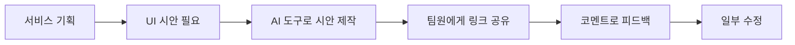
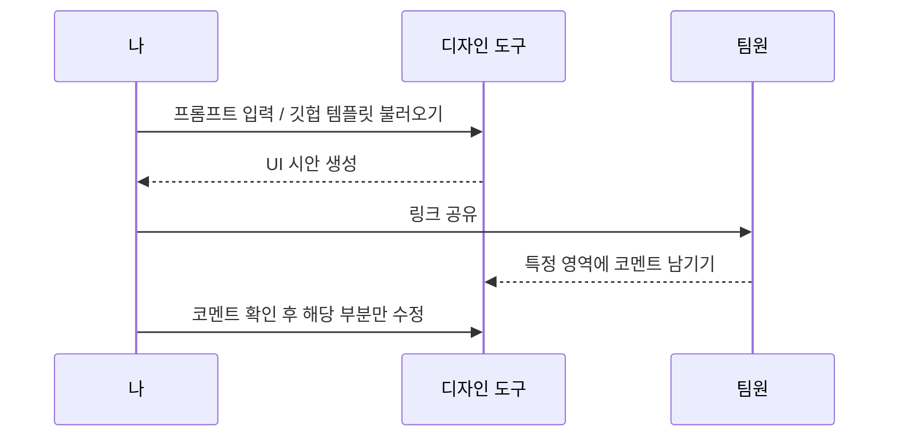

요즘 AI를 활용해서 간단한 서비스를 기획부터 제작까지 진행해보고 있는데요, 오늘 DAY 11에서는 그 연장선으로 실제 화면, 즉 **UI 디자인**을 AI 도구(피그마, Claude Design)로 만들어보고 팀원들과 공유해서 수정하는 실습을 진행했어요.

## 1. 왜 UI 디자인이 필요했나

서비스 아이디어와 기능 목록은 정리돼 있어도, 실제 화면이 없으면 팀원들과 "이 기능이 화면에서 어떻게 보여야 하는지"를 논의하기가 어려워요. 그래서 기획의 다음 단계로, AI 도구를 활용해 빠르게 UI 시안을 만들어보는 실습을 하게 됐어요.

## 2. 두 가지 방법으로 시안 만들어보기

오늘은 UI를 만드는 방법을 하나로 정하지 않고, **두 가지 방식**을 직접 비교해봤어요.

| 방법 | 방식 | 특징 |
|---|---|---|
| 직접 입력 | 프롬프트를 직접 타이핑해서 처음부터 새로 생성 | 원하는 형태를 세세하게 지정할 수 있지만, 처음부터 만들어야 해서 손이 더 감 |
| 템플릿 가져오기 | Claude Design에서 깃헙(GitHub) 레포지토리를 가져와서 그걸 바탕으로 제작 | 이미 존재하는 코드/컴포넌트 구조를 기반으로 하기 때문에 실제 프로젝트와 더 맞닿아 있는 결과물이 나옴 |

Claude Design은 깃헙 레포지토리나 로컬 코드베이스를 가져와서, 실제 코드에 있는 컴포넌트를 기반으로 디자인을 만들어주는 기능을 제공해요. 그래서 "완전히 새로 그리는 것"과 "이미 있는 프로젝트 구조 위에서 다듬는 것" 사이의 차이를 체감할 수 있었어요.

## 3. 팀원과 공유하고 피드백 받기

시안이 나온 뒤에는 **링크 공유 기능**으로 팀원들에게 결과물을 전달했고, **코멘트 기능**을 이용해 화면의 특정 부분에 피드백을 받아 일부분만 골라서 수정해봤어요.

전체를 다시 만드는 게 아니라, 코멘트가 달린 **영역 단위**로만 수정하니 리뷰-반영 사이클이 훨씬 가볍게 느껴졌어요. 텍스트로 "이 부분을 이렇게 바꿔주세요"라고 설명하는 것보다, 화면의 정확한 위치에 코멘트를 남기니 의도가 훨씬 명확하게 전달됐어요.

## 4. 오늘 느낀 점

- **처음부터 만드는 것 vs 있는 걸 기반으로 다듬는 것**은 완전히 다른 작업처럼 느껴졌어요. 특히 실제 서비스 코드와 이어지는 결과물이 필요하다면, 깃헙 레포지토리를 가져와 만드는 방식이 더 실용적이라는 걸 체감했어요.
- 링크 공유와 코멘트 기능 덕분에, 디자인 리뷰가 "전체를 다시 보내고 받는 것"이 아니라 "부분만 짚어서 주고받는 것"으로 바뀌었어요. 이게 협업 속도에 꽤 큰 영향을 준다는 걸 느꼈어요.

## 더 학습하면 좋은 개념

- **Auto Layout / 컴포넌트(Component)** — 오늘은 시안을 만드는 데 집중했는데, 실제로 팀에서 재사용하려면 반복되는 요소를 컴포넌트로 묶고 자동 정렬(Auto Layout)하는 방법을 알아야 유지보수가 쉬워져요.
- **디자인 시스템(Design System)** — 여러 시안을 넘나들며 일관된 스타일을 유지하려면, 색상·타이포그래피·버튼 규칙 등을 모아둔 디자인 시스템 개념을 이해할 필요가 있어요.
- **Figma Dev Mode(개발자 모드)** — 디자인이 실제 코드로 얼마나 가깝게 이어지는지 확인하려면, 디자인 파일에서 바로 CSS/코드 스니펫을 확인할 수 있는 Dev Mode를 익혀두면 좋아요.
- **버전 관리 기반 디자인 리뷰 프로세스** — 오늘처럼 코멘트로 부분 수정을 반복하다 보면, 어떤 버전에서 무엇이 바뀌었는지 추적하는 게 중요해져요. 깃(Git)의 브랜치/커밋 개념과 비슷한 흐름으로, 디자인 버전을 관리하는 방법을 더 알아볼 필요가 있어요.

## 참고 자료

- [Claude Design — Turn Ideas into Design](https://claude.com/product/design)
- [Figma 공식 문서 - Share files and prototypes](https://help.figma.com/hc/en-us/articles/360040531773-Share-files-and-prototypes)
- [Figma 공식 문서 - Add comments to files](https://help.figma.com/hc/en-us/articles/360041068574-Add-comments-to-files)

오늘은 여기까지예요! 다음에는 팀원들의 피드백을 반영한 최종 시안을 실제 코드로 옮기는 과정을 정리해볼게요.
